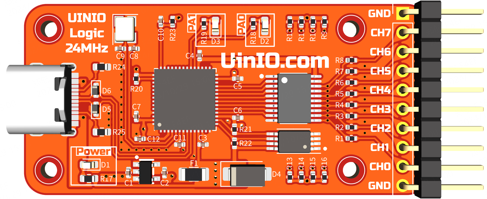
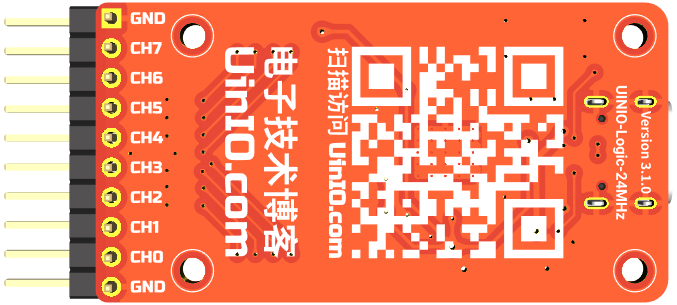

# UINIO-Logic-24MHz 逻辑分析仪

[**UINIO-Logic-24MHz**](https://gitee.com/uinika/UINIO-Logic-24MHz) 是一款基于**英飞凌**（已收购**赛普拉斯 Cypress**）的 [**CY7C68013A**](https://www.infineon.com/cms/en/product/universal-serial-bus-usb-power-delivery-controller/peripheral-controllers/ez-usb-fx2lp/cy7c68013a-56ltxit/) 型 `USB2.0` 控制器，以及 [**Sigork**](https://sigrok.org/) 开源固件方案的逻辑分析仪电路设计。拥有 `24MHz` 采样频率，以及 **8** 个采样通道。

## 设计概要

1. 采用 **USB Type-C** 接口，以及 `10 Pin` 的牛角插座；
2. **CY7C68013A** 型 USB 控制器芯片采用了体积较小的 `QFN56` 封装；
3. **AT24C64** 微芯 EEPROM 存储器芯片同样采用体积小巧的 `TSSOP8` 封装；
4. 板载 `24MHz` 无源贴片晶振，阻容贴片元件全部采用 `0402` 的小规格封装；
5. 增加具有**三态输出**功能的 **74HC245** 八路信号收发器，提升信号采集的稳定性；
6. 低压差线性稳压器可以灵活选用 `ME6211C33M5G` 或者 `A6303AE5R-33A` 等 `SOT23-5` 封装的 **LDO** 芯片；

## 注意事项

- LED 指示灯 `D2` 连接至 **CY7C68013A** 的 `PA0` 引脚，而 `D3` 则被连接至 `PA1` 引脚；
- 需要结合 **Sigork** 的开源固件 [sigrok-firmware-fx2lafw](https://github.com/wuxx/sigrok-firmware-fx2lafw)，并且搭配 [PulseView](https://sigrok.org/wiki/Downloads) 上位机协同使用；

## 参考技术文档

[UinIO.com 电子技术实验室](http://uinio.com/) 为 UINIO-Logic-24MHz 开源项目提供了如下一系列技术参考资料：

- [**《快速上手 UINIO-Logic-24MHz 逻辑分析仪》**](http://uinio.com/Project/UINIO-Logic-24MHz/) ：分析了 UINIO-Logic-24MHz 的硬件原理，并且介绍了配套上位机软件 [PulseView](https://sigrok.org/wiki/Downloads) 的使用。
- [**《BOM 交互式物料清单与 PCB 布线在线预览》**](http://uinio.com/archives/BOM/UINIO-Logic-24MHz.html)：列举 UINIO-Logic-24MHz 硬件 PCB 所涉及物料的同时，还提供了布线的预览。
