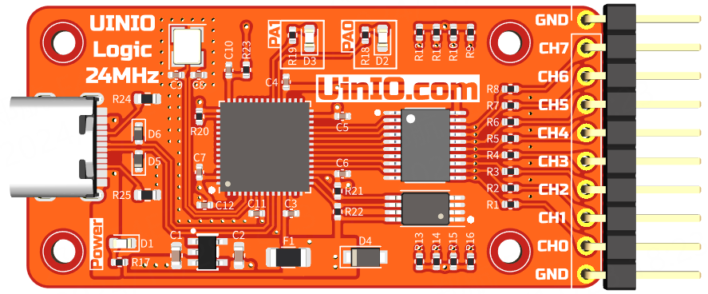
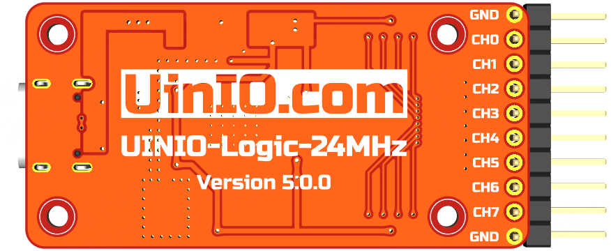

# UINIO-Logic-24MHz 逻辑分析仪

本款逻辑分析仪基于**英飞凌**（已收购**赛普拉斯 Cypress**）公司推出的 [**CY7C68013A**](https://www.infineon.com/cms/en/product/universal-serial-bus-usb-power-delivery-controller/peripheral-controllers/ez-usb-fx2lp/cy7c68013a-56ltxit/) 型 USB2.0 微控制器以及 [**Sigork**](https://sigrok.org/) 开源固件方案，拥有 `24MHz` 采样频率和 **8** 个采样通道。

 

## 功能概要

- **CY7C68013A** USB 主控芯片采用体积较小的 `QFN56` 封装；
- **AT24C64** EEPROM 存储器芯片同样采用体积小巧的 `TSSOP8` 封装，可通过 **PCB** 上面的两组 **Solder Jumper** 选择其 **I²C** 总线地址；
- 板载 `24MHz` 无源贴片晶振，阻容贴片元件全部采用 `0402` 的小规格封装；
- 采用 **USB Type-C** 接口，以及 `10 Pin` 的牛角插座；
- 低压差线性稳压器可以灵活选用 `ME6211C33M5G` 或者 `A6303AE5R-33A` 等 `SOT23-5` 封装的 **LDO** 芯片；

## 注意事项

- 需要下载 **Sigork** 的开源固件 [sigrok-firmware-fx2lafw](https://github.com/wuxx/sigrok-firmware-fx2lafw)，并且搭配 [PulseView](https://sigrok.org/wiki/Downloads) 上位机客户端进行使用；
